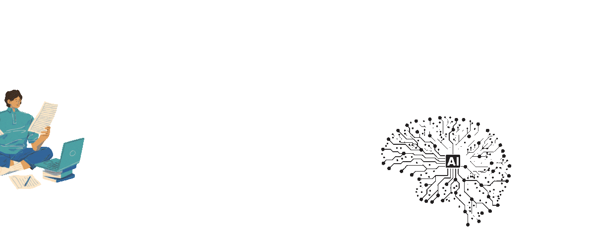

 **Salut, je suis OURTI ABDELILAH**

  

## IA Engineering|Data Scientist | Data Analyst 

  
  

  

------------
## 👨‍🎓 Étudiant en Ingénierie de l'Intelligence Artificielle

#### Je suis **Abdelilah Ourti**, un étudiant passionné et motivé, actuellement en deuxième année à l'**ENIAD** (École Nationale d'Intelligence Artificielle et du Digital) à Berkane, au Maroc.

Je me spécialise en **Data Science**, **Machine Learning**, **Deep Learning** et **Vision par Ordinateur**. Je porte également un vif intérêt au **Traitement du Langage Naturel (NLP)** ainsi qu'aux **Grands Modèles de Langage (LLMs)**.

Je m'intéresse également au **MLOps** et à l’**IA Responsable**, avec pour objectif de contribuer au développement de solutions d’intelligence artificielle innovantes et éthiques.

### 🌍 Mon objectif :

Je vise à **développer des solutions IA** éthiques et durables, avec un fort accent sur la **responsabilité** et l’**impact social** des technologies que nous créons.

-----------
##  Mes Compétences

### 🔹 Langages de Programmation
- Python (Pandas, NumPy, Scikit-learn, TensorFlow, Keras)
- SQL, NoSQL (MongoDB)
- React,HTML, CSS, Power Query, Excel VBA
- Java ,**C**,**C++**,**C#**

### 📊 Analyse et Visualisation de Données
- Matplotlib, Seaborn,foluim

### 🤖 Machine Learning & Deep learning 
- Apprentissage supervisé et non supervisé : Régression, Classification, Clustering
- Apprentissage par renforcement : Agents intelligents, Politique d’action, Récompense et Exploration/Exploitation
- **NLP** (Traitement du langage naturel) : BERT, CountVectorizer, TF-IDF, Word2Vec
- **CNN** (Réseaux de Neurones Convolutifs) : Classification d'images, Détection d'objets, Segmentation sémantique
- **RNN** (Réseaux de neurones récurrents)  : LSTM, GRU, Modélisation de séquences, Prévision de séries temporelles

🚀 N'hésite pas à explorer mes projets et à me contacter pour toute opportunité ! 🚀  
## 📌 Mes Projets 

🔷 **📚 Data Scientist - OpenClassrooms / CentraleSupélec**  

- [**📊 Projet 4 : La Construction d'un modèle de scoring**](https://github.com/Abdelilah04116/Construisez-un-mod-le-de-scoring)
- [**📊 Projet 5 : La Segmentation des clients d'un site e-commerce**](https://github.com/Abdelilah04116/Segmentez_des_clients_d_un_site_ecommerce)

🔷 **📚 Les Projets Académiques**

- [**📊 Projet 1 : La Construction un modèle de classification des actualités**](https://github.com/Abdelilah04116/fake-and-real-news-Classification-)
- [**📊 Projet 2 : RAG Application**](https://github.com/Abdelilah04116/RAG_Project)

 
