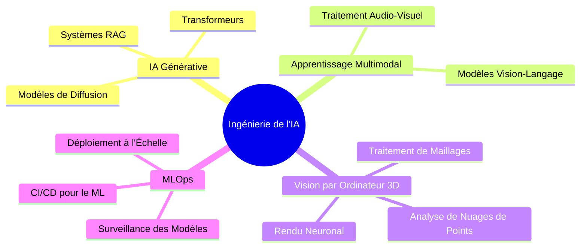

 **Salut, je suis OURTI ABDELILAH**

<div align="center">
  

## IA Engineering|Data Scientist | Data Analyst 

[](https://www.linkedin.com/in/abdelilah-ourti)
  [](https://www.kaggle.com/abdelilahourti)
  [](mailto:abdelilahourti@gmail.com)

<div align="center">
  

------------
## 👨‍🎓 Étudiant en Ingénierie de l'Intelligence Artificielle


#### Je suis **Abdelilah Ourti**, un étudiant passionné et motivé, actuellement en deuxième année à l'**ENIAD** (École Nationale d'Intelligence Artificielle et du Digital) à Berkane, au Maroc.

Je me spécialise en **Data Science**, **Machine Learning**, **Deep Learning** et **Vision par Ordinateur**. Je porte également un vif intérêt au **Traitement du Langage Naturel (NLP)** ainsi qu'aux **Grands Modèles de Langage (LLMs)**.

Je m'intéresse également au **MLOps** et à l’**IA Responsable**, avec pour objectif de contribuer au développement de solutions d’intelligence artificielle innovantes et éthiques.


------------
## Objectif actuel:
Je vise à **développer des solutions IA** éthiques et durables, avec un fort accent sur la **responsabilité** et l’**impact social** des technologies que nous créons.


```mermaid
mindmap
  root((Ingénierie de l'IA))
    IA Générative
      Modèles de Diffusion
      Transformeurs
      Systèmes RAG
    Apprentissage Multimodal
      Modèles Vision-Langage
      Traitement Audio-Visuel
    Vision par Ordinateur 3D
      Rendu Neuronal
      Analyse de Nuages de Points
      Traitement de Maillages
    MLOps
      CI/CD pour le ML
      Surveillance des Modèles
      Déploiement à l'Échelle
```
-----------
##  Compétences et Technologies

<div align="center">
  <!-- Animated Skills Chart -->
  
  
  ```mermaid
graph TD
    AI((AI/ML: Artificial Intelligence & Machine Learning))
    CV((Computer Vision: Image & Video Analysis))
    NLP((Natural Language Processing: Text & Language Models))
    MLOps((MLOps: Machine Learning Operations))
    Tools((Tools: Libraries, Frameworks, and Platforms))
    
    AI --- CV
    AI --- NLP
    AI --- DB
    AI --- MLOps
    AI --- WD
    MLOps --- Tools
    WD --- Tools
    
    classDef main fill:#ffb3b3,stroke:#ff0000,stroke-width:2px
    classDef major fill:#b3ffb3,stroke:#00cc44,stroke-width:2px
    classDef minor fill:#b3d9ff,stroke:#0066cc,stroke-width:2px
    
    class AI main
    class CV,NLP,MLOps major
    class WD,DB,Tools minor

  ```
</div>

<details open>
<summary><b>Programming Languages</b></summary>
<br>
<div>
  
  
  
  
  
  
  
  
  
  
</div>
</details>

<details>
<summary><b>AI/ML Frameworks</b></summary>
<br>
<div>
  
  
  
  
  
  
  
  
  
  
</div>
</details>

<details>
<summary><b>Computer Vision & NLP</b></summary>
<br>
<div>
  
  
  
  
  
  
  
  
  
  
</div>
</details>

<details>
<summary><b>MLOps & Cloud</b></summary>
<br>
<div>
  
  
  
  
  
  
  
  
  
  
</div>
</details>

<details>
<summary><b>3D & Graphics Tools</b></summary>
<br>
<div>
  
  
  
  
  
  
  
  
</div>
</details>

<div align="center">
  <!-- Interactive Technology Expertise Radar Chart -->
  
</div>

---

<a id="github-stats"></a>

### 🔹 Langages de Programmation
- Python (Pandas, NumPy, Scikit-learn, TensorFlow, Keras)
- SQL, NoSQL (MongoDB)
- React,HTML, CSS, Power Query, Excel VBA
- Java ,**C**,**C++**,**C#**

### 📊 Analyse et Visualisation de Données
- Matplotlib, Seaborn,foluim

### 🤖 Machine Learning & Deep learning 
- Apprentissage supervisé et non supervisé : Régression, Classification, Clustering
- Apprentissage par renforcement : Agents intelligents, Politique d’action, Récompense et Exploration/Exploitation
- **NLP** (Traitement du langage naturel) : BERT, CountVectorizer, TF-IDF, Word2Vec
- **CNN** (Réseaux de Neurones Convolutifs) : Classification d'images, Détection d'objets, Segmentation sémantique
- **RNN** (Réseaux de neurones récurrents)  : LSTM, GRU, Modélisation de séquences, Prévision de séries temporelles


🚀 N'hésite pas à explorer mes projets et à me contacter pour toute opportunité ! 🚀  
## 📌 Mes Projets 

🔷 **📚 Data Scientist - OpenClassrooms / CentraleSupélec**  

- [**📊 Projet 4 : La Construction d'un modèle de scoring**](https://github.com/Abdelilah04116/Construisez-un-mod-le-de-scoring)
- [**📊 Projet 5 : La Segmentation des clients d'un site e-commerce**](https://github.com/Abdelilah04116/Segmentez_des_clients_d_un_site_ecommerce)


🔷 **📚 Les Projets Académiques**

- [**📊 Projet 1 : La Construction un modèle de classification des actualités**](https://github.com/Abdelilah04116/fake-and-real-news-Classification-)
- [**📊 Projet 2 : RAG Application**](https://github.com/Abdelilah04116/RAG_Project)


 
